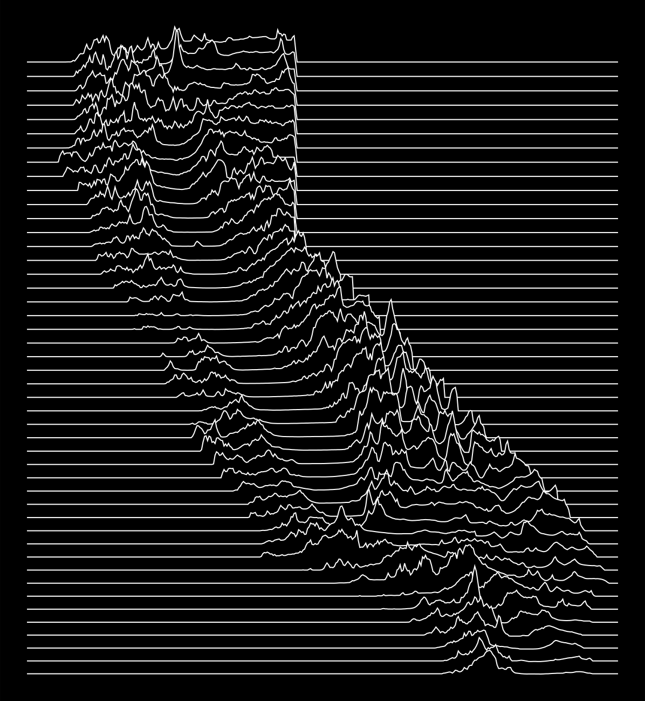

# unknown-states

Generates a ridgeline SVG or PNG elevation map of any US state in the style of
Joy Division's *Unknown Pleasures* album cover.

[Peter Saville](https://en.wikipedia.org/wiki/Peter_Saville_(graphic_designer)) designed the album cover for [Joy Division](https://en.wikipedia.org/wiki/Joy_Division_discography#Studio_albums) in 1978 based on 
a simple ridgeline graph of pulse waves transmitted by the first radio pulsar ever discovered [PSR B1919+21](https://en.wikipedia.org/wiki/PSR_B1919%2B21) (originally designated *CP1919*). 
The pulsar, around 1000 light years from Earth, was discovered in 1967 by 
[Jocelyn Bell Burnell](https://en.wikipedia.org/wiki/Jocelyn_Bell_Burnell) at Cambridge University.
The data was acquired at the [Arecibo Radio Observatory](https://en.wikipedia.org/wiki/Arecibo_Observatory) in Puerto Rico 
and compiled by 
[Howard D. Craft for his doctoral thesis in 1979](https://www.proquest.com/openview/27b1e7fe479f69693d29237b333ced3b/1?pq-origsite=gscholar&cbl=18750&diss=y). 

A pulsar is a rapidly rotating neutron star-- as the pulsar rotates, it emits strong radio energy in a coherent directional beam like a lighthouse. 
Each line represents a pulse in a single rotation, and Craft decided to stack successive pulses as a way to visualize 
the smaller pulses within the larger ones. Later the image was published in *The Cambridge Encyclopaedia of Astronomy*, 
which is where it was found by [Bernard Sumner](https://en.wikipedia.org/wiki/Bernard_Sumner), Joy Division's lead guitarist. Sumner suggested it to Saville, and 
Saville reversed the image from black lines-on-white to white lines-on-black for artistic and aesthetic reasons.



## Setup

### 1. Required system libraries

You'll need librsvg installed on your system for PNG generation.

```bash
brew install librsvg            # for macOS
sudo apt install librsvg2-bin   # for debian/ubuntu
```

### 2. Python environment

```bash
python3 -m venv env
source env/bin/activate          # Windows: env\Scripts\activate
pip install -r requirements.txt
```

### 3. OpenTopography API key

Elevation data is downloaded from OpenTopography (SRTMGL1, 1 arc-second).
Register for a free key at https://portal.opentopography.org/myopentopo then:

```bash
export OT_API_KEY=your_key_here
```

Add that line to your `~/.zshrc` or `~/.bashrc` to make it permanent. Alternately, you can pass it as a command-line argument to `fetch_dem_urls.py`.

---

## Workflow

There are three steps: fetch tiles → preprocess → generate SVG.

### Step 1 — Get elevation tiles (GeoTIFFs)

**For California** (tiles already listed in `geotiffs/dem.csv`):
```bash
./download.py
```

**For any other state**, use `fetch_dem_urls.py`. This reads `US_State_Bounding_Boxes.csv` and writes `geotiffs/dem.csv` with
one OpenTopography URL per 1°×1° tile covering the state.
```bash
./fetch_dem_urls.py --state Colorado
./download.py
```

Each 1°×1° tile is roughly 30–60 MB (1 arc-second / ~30 m resolution from USGS 3DEP).  
This may take a while on a slow connection. Even on a fast connection, you've got time to get a cup of coffee.

#### Options for `fetch_dem_urls.py`

| Flag          | Default    | Description                                                            |
|---------------|------------|------------------------------------------------------------------------|
| `--state`     | California | State name, e.g. "Colorado", or "California"                           |
| `--api-key`   | *None*     | OpenTopography API key. Overrides the OT_API_KEY environment variable. |


### Step 2 — Preprocess

Fetches the state border from the US Census Bureau and scans the GeoTIFFs to
produce `state_dem.py`, `state_border_lon.npy`, and `state_border_lat.npy`.

```bash
./preprocess.py --state Colorado
```

Default state is California if `--state` is omitted.

#### Options

| Flag | Default | Description |
|------|---------|-------------|
| `--state` | state in `state_dem.py` | State name (must match Census name) |


### Step 3 — Generate the SVG

```bash
./ridge_map.py --state Colorado
```

Output: `colorado.svg` (named automatically from the state).

#### Options

| Flag | Default | Description |
|------|---------|-------------|
| `--state` | state in `state_dem.py` | State name (must match Census name) |
| `--spacing` | `0.2` | Degrees between ridgelines (smaller = more lines) |
| `--output` | `<state>.svg` | Output filename |

Example with custom spacing and output name:
```bash
./ridge_map.py --state Colorado --spacing 0.15 --output co_fine.svg
```

---

## Switching states

Clear the old tiles before downloading new ones:

```bash
./clean.sh
./fetch_dem_urls.py --state California
./download.py
./preprocess.py --state California
./ridge_map.py --state California
```

---

## Data Sources

### Elevation
OpenTopography SRTMGL1 (NASA SRTM, 1 arc-second / ~30m resolution).

https://portal.opentopography.org/

### State Boundaries
US Census Bureau Cartographic Boundary Files (TIGER/Line), 2022, 1:500k.
Fetched automatically by `preprocess.py`.

https://www2.census.gov/geo/tiger/GENZ2022/shp/cb_2022_us_state_500k.zip

### Bounding Boxes
`US_State_Bounding_Boxes.csv` — drives tile generation in `fetch_dem_urls.py`
and lat range selection in `ridge_map.py`.

https://gist.github.com/a8dx/2340f9527af64f8ef8439366de981168/#file-us_state_bounding_boxes-csv

```diff
- Original code adapted from geodynamics-liberation-front/california-pleasures by ripetersen (licensed under GPL-3.0)
```
## Changes from the original code

1. Updated state boundary file links to use census.gov. The Esri links were dead.
2. Changed DEM source to OpenTopography because USGS is missing tiles and just generally bad.
3. Updated to use python in a virtualenv (requirements.txt) instead of anaconda.
4. Generalized to use any state, rather than just California.
5. Adapted to use geopandas and got rid of calls to beautifulsoup.
6. Modernization: Added type hints and return hints.
7. Added optional PNG generation.
8. Code rewrites to handle different data sources.
9. Added state bounding boxes.