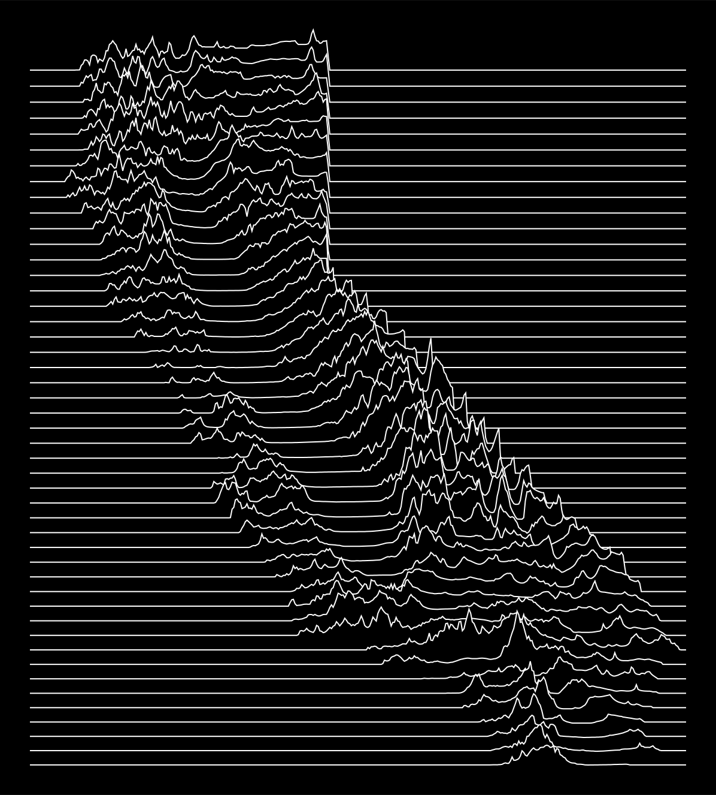

# california-pleasures

Creates an image of California in the style of Joy Division's *Unknown Pleasures* album cover.

```diff
- Code adapted from geodynamics-liberation-front/california-pleasures by ripetersen
```

## Changes from the original code

1. Updated state boundary file links to use census.gov. The Esri links were dead.
2. Updated to use python in a virtualenv (requirements.txt) instead of anaconda.
3. Changed download tif step to only run one download script for the tifs.
4. Adapted to use geopandas and got rid of calls to beautifulsoup.
5. Modernization: Added type hints and return hints.
6. Added optional PNG generation.

## Setup

### 1. Required system libraries

Need librsvg installed on your system for PNG generation.

On Macs:
```bash
brew install librsvg
```

On Linux (Debian/Ubuntu):
```bash
sudo apt install librsvg2-bin
```

### 2. Python environment (venv)

```bash
python3 -m venv .venv
source .venv/bin/activate          # Windows: .venv\Scripts\activate
pip install -r requirements.txt
```

### 3. Download elevation data (GeoTIFFs)

The `geotifs/` directory contains `dem.csv` and `download.sh`.  
`download.sh` reads the GeoTIFF URLs out of column 17 of `dem.csv` and fetches them with `wget`.

```bash
cd geotifs
./download.sh      # downloads ~70 1°×1° USGS tiles into geotifs/
cd ..
```

Each tile is roughly 30–60 MB (1 arc-second / ~30 m resolution from USGS 3DEP).  
This may take a while on a slow connection. Even on a fast connection, you've got time to get a cup of coffee.

> **Alternative (single file, lower resolution):** You can download the entire
> California bounding box as one GeoTIFF from OpenTopography:
> ```bash
> curl -o geotifs/california_srtm.tif \
>   'https://portal.opentopography.org/API/globaldem?demtype=SRTMGL3&south=32.534156&north=42.009518&west=-124.409591&east=-114.131211&outputFormat=GTiff&API_Key=demoapikeyot2022'
> ```
> Note 1: The demo API key has rate limits. Register at opentopography.org for a free key.
> 
> Note 2: The bounding box in the URL parameters is tighter than the GeoTIFF tiles because the values are set manually. Change the max/min lat and longs to whatever you aesthetically prefer.

### 4. Preprocess (border + elevation metadata)

`preprocess.py` downloads the California border from the US Census Bureau
Cartographic Boundary files (no manual download needed) and scans the GeoTIFFs
to produce `california_dem.py`, `ca_border_lon.npy`, and `ca_border_lat.npy`.

```bash
./preprocess.py
```

### 5. Generate the SVG and PNG

Files are generated in output folder.

To generate both SVG and PNG
```bash
./ca_pleasures.py
```

Output: `ca_pleasures.svg, ca_pleasures.png`

To generate only SVG
```bash
./ca_pleasures.py --no-png
```

Output: `ca_pleasures.svg`

### 6. Clean up temporary files from processing
If you need to start over and re-generate the preprocess files.

```bash
./clean.sh
```

---

## Data Sources

### Elevation
USGS 3D Elevation Program (3DEP), 1 arc-second seamless tiles.  
URLs are listed in `geotifs/dem.csv` (column 17).  
Hosted on `prd-tnm.s3.amazonaws.com` — public, no authentication required.

Direct download UI: https://apps.nationalmap.gov/downloader/

### State Boundary
US Census Bureau Cartographic Boundary Files (TIGER/Line), 2022 vintage, 1:500k.  
Fetched automatically by `preprocess.py` from:  
https://www2.census.gov/geo/tiger/GENZ2022/shp/cb_2022_us_state_500k.zip

If Census releases a newer version, update the `CENSUS_CB_URL` constant in `preprocess.py`.

---

## Future plans

Make it easy to generate images of other states.

## Example image
